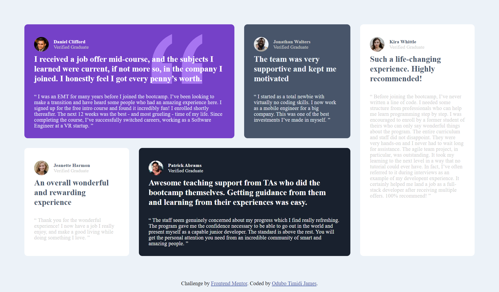

# testimonials-grid-section
# Frontend Mentor - Testimonials grid section solution

This is a solution to the [Testimonials grid section challenge on Frontend Mentor](https://www.frontendmentor.io/challenges/testimonials-grid-section-Nnw6J7Un7). Frontend Mentor challenges help you improve your coding skills by building realistic projects. 

## Table of contents

- [Overview](#overview)
  - [The challenge](#the-challenge)
  - [Screenshot](#screenshot)
  - [Links](#links)
- [My process](#my-process)
  - [What I learned](#what-i-learned)
  - [Continued development](#continued-development)
 

**Note: Delete this note and update the table of contents based on what sections you keep.**

## Overview

### The challenge

Users should be able to:

- View the optimal layout for the site depending on their device's screen size

### Screenshot

### Links

- Solution URL: [link to repo](https://github.com/timidij/testimonials-grid-section.git)
- Live Site URL: [click here](https://comfy-moxie-f04f6c.netlify.app/)

## My process

### Built with

- Semantic HTML5 markup
- CSS custom properties
- CSS Grid
- Mobile-first workflow
For styles

**Note: These are just examples. Delete this note and replace the list above with your own choices**

### What I learned
I learnt how to use and apply grid property to achieve the layoutin the design

### Continued development

### Useful resources

